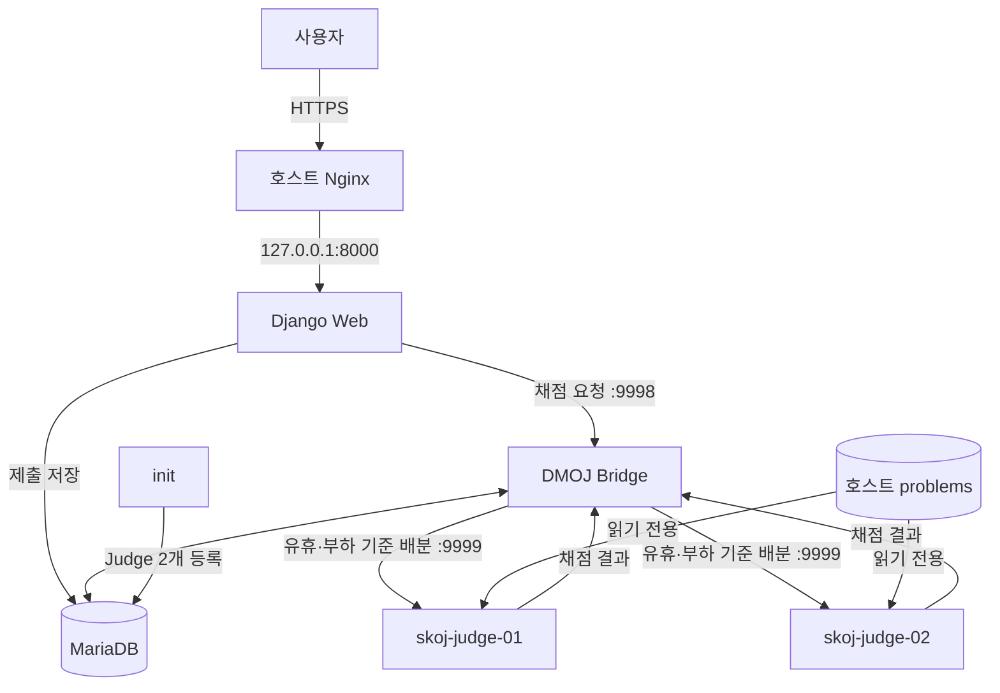

# Linux Docker 개발 환경

이 구성은 AMD64 또는 ARM64 Linux 서버의 Docker Engine에서 Ubuntu 22.04 기반 SKOJ 웹 애플리케이션과 MariaDB, Redis, Celery, Bridge, DMOJ Judge를 함께 실행합니다. Docker가 호스트 아키텍처에 맞는 이미지를 자동으로 선택합니다. 로컬 접근용이므로 웹 서비스는 `127.0.0.1:8000`에만 공개되며 Nginx와 HTTPS는 포함하지 않습니다.

## 1. 준비

- AMD64 또는 ARM64 Linux
- Docker Engine과 Docker Compose 플러그인
- 사용 가능 메모리 8GB 이상 권장
- `SYS_PTRACE` capability를 허용하는 일반 Docker 환경(rootless 또는 ptrace 제한 환경 제외)

프로젝트 루트에서 환경 파일과 영구 데이터 디렉터리를 준비합니다.

```sh
cp .env.docker.example .env.docker
mkdir -p data/mariadb data/static logs problems
```

- `data/mariadb`: MariaDB 데이터
- `data/static`: Django가 수집한 정적 파일
- `logs`: Django Web, Celery, Bridge 및 초기화 로그
- `problems`: 문제와 테스트 데이터

네 경로는 호스트 bind mount이므로 일반 종료뿐 아니라 `docker compose down --volumes`를 실행해도 삭제되지 않습니다.

`.env.docker`에서 최소한 다음 값을 다른 문자열로 변경합니다.

- `SECRET_KEY`
- `DB_PASSWORD`
- `DB_ROOT_PASSWORD`
- `JUDGE_KEY`
- `JUDGE_KEY_2`
- `DJANGO_SUPERUSER_USERNAME`
- `DJANGO_SUPERUSER_PASSWORD`
- `DJANGO_SUPERUSER_EMAIL`
- `EMAIL_HOST_PASSWORD`

`JUDGE_NAME/JUDGE_KEY`와 `JUDGE_NAME_2/JUDGE_KEY_2`는 자동 초기화와 각 Judge 컨테이너가 동일하게 사용합니다. 두 Judge는 서로 다른 이름과 인증 키를 사용해야 하며 기본값 `change-me`로는 초기화가 실패합니다. `.env.docker`는 Git에서 제외되므로 커밋하지 않습니다.

`init`은 Django superuser가 없는 최초 실행에만 위 관리자 정보로 계정을 생성합니다. 이미 superuser가 하나라도 있으면 기존 계정과 비밀번호를 변경하지 않습니다. 최초 생성 후에는 `.env.docker`에서 `DJANGO_SUPERUSER_PASSWORD`를 제거해도 이후 초기화가 정상적으로 건너뜁니다.

### Gmail 메일 발송 설정

회원가입 인증, 활성화 메일 재전송, 비밀번호 재설정과 아이디 찾기는 Gmail SMTP를 사용합니다. 발송 계정에서 2단계 인증을 활성화하고 SKOJ 전용 앱 비밀번호를 만든 뒤 `.env.docker`의 다음 값을 설정합니다.

```dotenv
EMAIL_HOST=smtp.gmail.com
EMAIL_PORT=587
EMAIL_USE_TLS=True
EMAIL_USE_SSL=False
EMAIL_HOST_USER=skojteam@gmail.com
EMAIL_HOST_PASSWORD=16자리-앱-비밀번호
DEFAULT_FROM_EMAIL="SKOJ <skojteam@gmail.com>"
SERVER_EMAIL="SKOJ <skojteam@gmail.com>"
EMAIL_TIMEOUT=10
```

실제 앱 비밀번호는 `.env.docker.example`이나 Git에 기록하지 않습니다. Google이 앱 비밀번호를 네 글자씩 띄어 표시하더라도 설정에서 공백을 자동으로 제거합니다. Google 계정 비밀번호를 변경하면 기존 앱 비밀번호가 폐기될 수 있으므로 새 앱 비밀번호를 발급해 Web 컨테이너를 재생성합니다.

설정 변경 후 통제된 수신 주소로 SMTP 연결을 점검합니다.

```sh
docker compose --env-file .env.docker up -d --no-deps --force-recreate web
docker compose --env-file .env.docker exec web python manage.py shell -c \
  "from django.core.mail import send_mail; print(send_mail('SKOJ 메일 점검', 'SMTP 연결 점검입니다.', None, ['수신주소@example.com']))"
```

출력이 `1`인지 확인한 뒤 테스트 계정으로 회원가입, 인증 링크, 로그인, 비밀번호 재설정을 순서대로 점검합니다. 신규 가입자는 인증 전까지 로그인할 수 없지만 기존 활성 계정은 영향을 받지 않습니다.

두 Judge는 기본적으로 AMD64와 ARM64를 모두 제공하는 `dmoj/runtimes-tier1:latest` 이미지에 Temurin Java 17을 결합해 사용합니다. 특정 런타임 또는 Java 17 이미지를 사용해야 하면 `.env.docker`의 `DMOJ_RUNTIMES_IMAGE` 또는 `JAVA17_IMAGE`를 변경할 수 있습니다.

## 동작 아키텍처



Bridge는 각 Judge가 지원하는 문제와 언어, 현재 작업 여부와 부하를 바탕으로 제출을 배분합니다. 두 Judge가 모두 작업 중이면 제출은 Bridge 우선순위 큐에서 대기합니다. 같은 이름의 Judge가 다시 연결되면 기존 연결이 끊기므로 `docker compose --scale judge=2` 대신 이름과 키가 분리된 `judge`, `judge-02` 서비스를 사용합니다.

## 2. 전체 서비스 시작 및 자동 초기화

```sh
docker compose --env-file .env.docker up -d --build
```

처음에는 Ubuntu 패키지, Python 라이브러리, DMOJ 런타임을 내려받으므로 시간이 걸릴 수 있습니다.

Compose의 `init` 서비스는 MariaDB와 Redis가 정상 상태가 될 때까지 기다린 뒤 다음 작업을 자동으로 수행합니다.

컨테이너에서는 `python manage.py initialize_docker` 관리 명령이 실행됩니다.

- 데이터베이스 마이그레이션
- Django 번역 및 JavaScript 번역 파일 컴파일
- 정적 파일 수집
- 기본 언어(Python 3, C, C++17, Java 17) 등록 및 기존 C++14/Java 8 설정 전환
- 최초 Django 관리자 계정 생성
- `.env.docker`의 두 이름과 키를 사용한 Judge 등록 또는 인증 키 갱신

초기화 상태와 로그는 다음 명령으로 확인합니다.

```sh
docker compose --env-file .env.docker ps -a
docker compose --env-file .env.docker logs init
```

`init`가 종료 코드 0으로 완료된 뒤 Web, Celery, Bridge가 시작됩니다. 이 작업은 반복 실행해도 안전하며 같은 이름의 Judge가 있으면 중복 생성하지 않고 각 인증 키를 현재 `.env.docker` 값으로 갱신합니다.

## 3. 관리자 계정 확인

최초 실행에서는 `.env.docker`의 `DJANGO_SUPERUSER_*` 값으로 관리자 계정을 생성합니다. 기존 superuser가 있으면 이 단계를 건너뛰며 비밀번호를 변경하지 않습니다.

환경변수를 사용하지 않고 관리자를 직접 생성하거나 관리자를 추가하려면 다음 명령을 사용합니다.

```sh
docker compose --env-file .env.docker exec web python manage.py createsuperuser
```

기존 관리자 비밀번호를 변경하려면 다음 명령을 사용합니다.

```sh
docker compose --env-file .env.docker exec web python manage.py changepassword admin
```

브라우저에서 <http://127.0.0.1:8000> 또는 <http://127.0.0.1:8000/admin>을 엽니다.

서비스 상태와 로그는 다음 명령으로 확인합니다.

```sh
docker compose --env-file .env.docker ps
docker compose --env-file .env.docker logs -f web bridge judge judge-02
```

Judge가 `online`이 되지 않으면 해당 `JUDGE_NAME*`과 `JUDGE_KEY*`가 등록할 때 사용한 값과 같은지 먼저 확인합니다. `bridge`, `judge`, `judge-02` 로그에 인증 실패 또는 문제 디렉터리 오류가 있는지도 확인합니다.

두 번째 Judge의 이름과 키를 새로 추가하거나 변경했다면 먼저 `init`을 다시 실행해 DB 등록을 갱신한 뒤 두 번째 Judge만 기동합니다.

```sh
docker compose --env-file .env.docker run --rm init
docker compose --env-file .env.docker up -d --build --no-deps judge-02
docker compose --env-file .env.docker stop judge-02
```

`judge-02`를 중지해도 기존 `judge`는 계속 제출을 처리합니다. 장기간 제외할 때는 Admin에서 해당 Judge를 비활성화하고, 복구 시 Bridge 로그와 Admin의 `online` 상태를 함께 확인합니다.

## 4. 종료와 재시작

컨테이너를 종료하되 데이터베이스는 유지합니다.

```sh
docker compose --env-file .env.docker down
```

다시 시작할 때는 `docker compose --env-file .env.docker up -d`를 실행하면 됩니다. `init`가 다시 현재 구성을 적용한 뒤 종료됩니다. MariaDB 데이터, 정적 파일, 애플리케이션 로그, 문제 데이터는 각각 호스트의 `./data/mariadb`, `./data/static`, `./logs`, `./problems`에 유지됩니다. Redis 데이터는 Docker named volume에 유지됩니다.

`down --volumes`를 실행하면 Redis named volume은 삭제되지만 호스트 bind mount인 MariaDB, 정적 파일, 로그, 문제 데이터는 삭제되지 않습니다. MariaDB를 초기화하려면 컨테이너를 내린 상태에서 `DB_DATA_DIR`의 실제 호스트 디렉터리를 별도로 비워야 하므로, 필요한 데이터를 먼저 백업하세요.

기존 `mariadb_data` named volume을 사용한 적이 있다면 이 변경이 그 데이터를 자동으로 `./data/mariadb`로 옮기지는 않습니다. 기존 데이터가 필요한 환경에서는 새 구성을 시작하기 전에 SQL dump/restore 방식으로 이전하세요.

## 구성 개요

- `web`: Gunicorn worker 5개로 실행하는 Django 애플리케이션, 호스트의 `127.0.0.1:8000`에만 공개
- `db`: MariaDB 10.11, Docker 내부 네트워크 전용, 데이터는 `./data/mariadb`에 저장
- 정적 파일: `init`에서 수집하여 호스트의 `./data/static`에 저장
- `redis`: 캐시 및 Celery 브로커, Docker 내부 네트워크 전용
- `init`: 마이그레이션, 정적 파일 수집, Judge 등록 후 종료되는 초기화 작업
- `celery`: 비동기 작업 처리
- `bridge`: 웹 애플리케이션과 Judge 연결
- `judge`: `skoj-judge-01`로 접속하는 첫 번째 DMOJ 채점기
- `judge-02`: `skoj-judge-02`로 접속하는 두 번째 DMOJ 채점기

두 Judge는 같은 `problems` 디렉터리를 읽기 전용으로 감시하므로 문제 파일을 추가·수정하면 재시작 없이 지원 문제 목록을 함께 갱신합니다.

웹 소스는 `./site`가 컨테이너에 마운트됩니다. 운영용 Gunicorn은 소스 변경을 자동으로 다시 읽지 않으므로 Python 코드를 배포한 뒤 `docker compose --env-file .env.docker restart web`로 Web 서비스를 재시작합니다. Django 계열 서비스의 파일 로그는 `./logs`에 저장됩니다. Docker 전용 설정은 추적 중인 `settings.example.py`를 기본값으로 사용하고 `docker/django/local_settings.py`에서 Linux 경로와 서비스 주소를 적용합니다.
